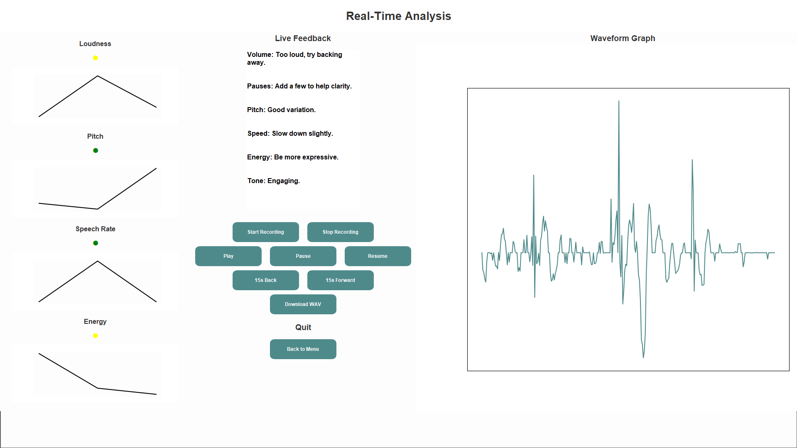
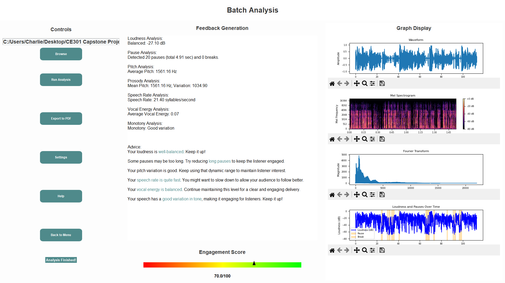
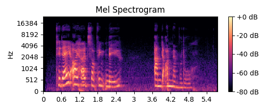

# **Enhancing Lecturer Engagement Ability Through Speech Signal Processing**

## **Project Overview**

This project has been created to assist lecturers in delivering more effective and engaging lectures by analysing vocal patterns, tone, energy, and pacing all within 7 different feature variables. Through audio analysis, my tool is able to provide insightful feedback to help lecturers refine their speaking style, making their delivery clearer and more engaging.

My program is ready for use with minimal configuration for audio analysis and feedback. It provides a comprehensive suite of features to help lecturers refine their vocal delivery and improve the quality of their lectures. If there are any issues, you can navigate to the help page, and if further configuration is necessary for your environment or vocal features, be sure to change the settings on the settings page.

---

## **Features**

- **Audio File Support**  
  Load `.wav` and `.mp3` audio files for analysis.

- **Real-Time Audio Analysis**  
  Analyse audio in real-time during recording or playback, with live feedback and visualisations.

- **Offline Batch Analysis**  
  Upload pre-recorded audio files, and perform in depth analysis on them.

- **Audio Recording & Playback**
  - Record and save voice input as `.wav` files.
  - Play back audio directly in the application.
  - Receive confirmation notifications when recordings or plots are saved.

- **Graphical Visualisations**
  - **Waveform**: Displays amplitude over time to reflect changes in loudness.
  - **Mel Spectrogram**: Visualizes energy across frequencies in a way that mimics human hearing.
  - **Fourier Transform (FFT)**: Reveals frequency components to analyze pitch and tone.
  - **Loudness & Pauses**: Shows loudness trends and highlights both short pauses and longer breaks.

- **Speech Feedback & Analysis**
  - **Loudness Analysis**: Calculates average loudness and provides feedback.
  - **Pause & Break Detection**: Differentiates between short pauses and long breaks using adjustable thresholds.
  - **Pitch & Prosody Analysis**: Evaluates pitch variability and speech dynamics.
  - **Monotony Detection**: Detects lack of vocal variation using pitch standard deviation.
  - **Pacing Analysis**: Measures speaking speed to assess delivery rate.
  - **Engagement Scoring**: Combines vocal features to estimate the likelihood of maintaining audience engagement.

- **Graph Exporting**  
  Save visual graphs as image files with user notifications on successful export.

- **Settings page**  
  Configure settings for thresholding and time intervals in the settings page, which can change the result of analysis.


---

## **Getting Started**

### **Prerequisites**

Ensure you have the following libraries installed before running the program:

- **Python 3.7+**

- **Librosa**: For audio analysis and Mel Spectrogram generation.
  ```bash 
  pip install librosa
  
* **Matplotlib**: For generating visual plots.
    ```bash
    pip install matplotlib
    ```

* **NumPy**: For mathematical operations such as Fourier Transform.
    ```bash
    pip install numpy
    ```

* **TkinterDnD2**: For drag-and-drop functionality in the GUI.
    ```bash
    pip install tkinterdnd2
    ```

* **NumPy**: For computing math and arrays.
    ```bash
    pip install numpy
    ```

* **Threading**: For threading capabilities.
    ```bash
    pip install threading
    ```

* **OS**: For utilising the OS.
    ```bash
    pip install os
    ```

* **FPDF**: For exporting and generating PDF files.
    ```bash
    pip install fpdf
    ```

* **Time**
    ```bash
    pip install time
    ```

* **Math**: For computing basic math (floor division).
    ```bash
    pip install math
    ```

* **Queue**: For adding the queue data structure for analysis.
    ```bash
    pip install queue
    ```

* **WebBrowser**: For opening the browser when we export PDF.
    ```bash
    pip install webbrowser
    ```

* **Wave**: For downloading wav format audio files.
    ```bash
    pip install wave
    ```


### **Installation**

1. Clone this repository to your local machine.
2. Ensure all the necessary Python libraries are installed (see prerequisites).
3. Place your `.wav` audio file in the desired folder for analysis.

---

### **Running the Program**

1. Open your terminal or command prompt.
2. Run the Python script:
    ```bash
    python AudioAnalysisApp.py
    ```
3. Select the module you want to run (Real-time or Batch Analysis)

4. Depending on the module:
    * **Batch Analysis**: Select audio file you want (`.wav` or `.mp3`)
    * **FFT Plot**: Displaying the frequency content of the voice.
    * **Mel Spectrogram Plot**: Showing the voice frequencies as perceived by humans.


---

### **How It Works**

* **Librosa** is used to load and analyse the audio file, calculating various features like the Mel Spectrogram and RMS (root-mean-square) energy.
* **NumPy** performs the Fast Fourier Transform (FFT) to transform the audio signal from the time domain into the frequency domain for analysis of voice dynamics.
* **Matplotlib** generates the plots, embedding the graphs in the GUI for easy visualisation and understanding of vocal patterns.
* **TkinterDnD2** adds drag-and-drop capability, making it easier to load audio files into the GUI.
* **Real-Time Analysis**: The tool can now display visual plots while recording or analysing live audio and generate dynamic feedback during the session.


---

### **Example Workflow**

1. **Launch the application** by running the Python script (`AudioAnalysisApp.py`).
2. **Load an audio file** (.wav) either by dragging it into the application or selecting it manually through the file dialog.
3. **Run Analysis**: Generate all of the feedback.
4. **Audio Feedback**: Feedback will be based to your audio file and will attempt to be as constructive as possible, with an engagement score giving the overall for what your engagement levels were.
5. **Download Options**: You can save your report or visual plots as files in the same directory, with notifications confirming successful saves.


---

## **Demo**

Below are examples of the application in action:

- **Real-time Analysis Interface**  
  

- **Batch Analysis Interface**  
  

- **Mel Spectrogram Display**  
  


---

## **Help & Troubleshooting**

- **Microphone Not Detected**: Ensure system permissions are granted for microphone access.
- **File Not Loading**: Verify the audio file format is supported (`.wav`, `.mp3`) and not corrupted.
- **Missing Libraries**: Double-check all `pip install` steps listed above.
- **GUI Not Displaying**: Ensure Python GUI libraries (Tkinter) are installed and compatible with your OS.


---

## **Future Improvements**

- Eye-tracking for delivery analysis.
- AI-generated feedback text.
- More inclusive support for different accents and languages.
- Cloud-based version.
- Mobile app for on-the-go review.


---

## **Acknowledgements**

I would like to thank the following people for their support and contributions to my project:

- **Dr Tasos Papastylianou** – for their valuable support and feedback throughout the project.
- **Family** – for helping with motivation.
- **My peers** – for testing my program.

